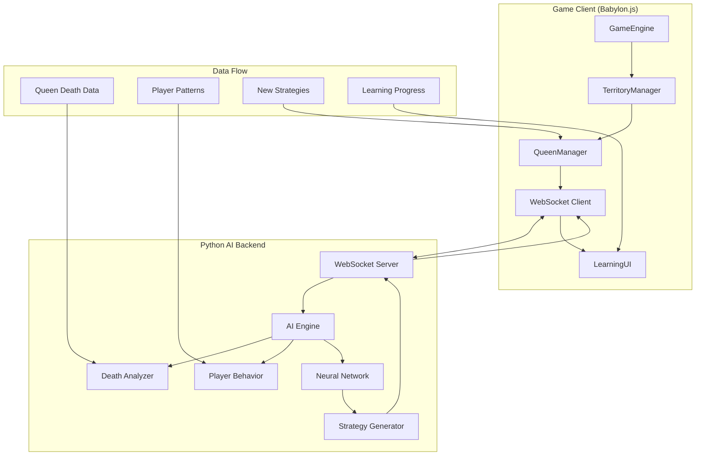

# Design Document

## Overview

The Adaptive Queen Intelligence system transforms Nexus of Mind from territorial warfare into an evolving AI challenge where Queens learn and adapt through neural network evolution. This system introduces generational learning where each Queen death triggers neural network training, creating progressively smarter opponents that adapt to individual player strategies. Building directly on the completed Queen & Territory System (Phase II), this design creates genuinely intelligent AI opponents that never become predictable.

The system separates AI computation from game rendering by implementing a Python backend service that handles neural network training while the Babylon.js client maintains 60fps performance. Each Queen death becomes a learning opportunity, with comprehensive data analysis feeding into TensorFlow neural networks that generate increasingly sophisticated strategies.

## Architecture

### System Integration Overview



### Neural Network Architecture

The system uses a compact but effective neural network designed for real-time training during Queen growth phases (60-120 seconds).

```python
# TensorFlow Neural Network Architecture
class QueenBehaviorNetwork:
    def __init__(self):
        self.model = tf.keras.Sequential([
            # Input layer: 50 features (game state, player patterns, death analysis)
            tf.keras.layers.Dense(128, activation='relu', input_shape=(50,)),
            tf.keras.layers.Dropout(0.2),  # Prevent overfitting
            
            # Hidden layers with decreasing complexity
            tf.keras.layers.Dense(64, activation='relu'),
            tf.keras.layers.Dropout(0.2),
            
            tf.keras.layers.Dense(32, activation='relu'),
            
            # Output layer: 20 possible strategies
            tf.keras.layers.Dense(20, activation='softmax')
        ])
        
        # Compile with Adam optimizer for fast convergence
        self.model.compile(
            optimizer='adam',
            loss='categorical_crossentropy',
            metrics=['accuracy']
        )
        
        # Enable GPU acceleration if available
        self.use_gpu = self._configure_gpu_acceleration()
        
    def _configure_gpu_acceleration(self) -> bool:
        """Configure GPU acceleration if CUDA is available"""
        try:
            gpus = tf.config.experimental.list_physical_devices('GPU')
            if gpus:
                # Enable memory growth to prevent GPU memory allocation issues
                for gpu in gpus:
                    tf.config.experimental.set_memory_growth(gpu, True)
                print(f"GPU acceleration enabled: {len(gpus)} GPU(s) available")
                return True
            else:
                print("No GPU available, using CPU for neural network training")
                return False
        except Exception as e:
            print(f"GPU configuration failed, falling back to CPU: {e}")
            return False
```

### WebSocket Communication Protocol

Real-time communication between the game client and Python backend enables seamless AI learning without impacting game performance.

```typescript
// Client-Server Message Protocol
interface QueenDeathMessage {
    type: 'queen_death';
    timestamp: number;
    data: {
        queenId: string;
        territoryId: string;
        generation: number;
        deathLocation: Vector3;
        deathCause: 'protector_assault' | 'worker_infiltration' | 'coordinated_attack';
        survivalTime: number;
        parasitesSpawned: number;
        hiveDiscoveryTime: number;
        playerUnits: {
            protectors: UnitData[];
            workers: UnitData[];
        };
        assaultPattern: AssaultPattern;
        gameState: GameStateSnapshot;
    };
}

interface QueenStrategyMessage {
    type: 'queen_strategy';
    timestamp: number;
    data: {
        queenId: string;
        generation: number;
        strategies: {
            hivePlacement: HivePlacementStrategy;
            parasiteSpawning: SpawnStrategy;
            defensiveCoordination: DefensiveStrategy;
            predictiveBehavior: PredictiveStrategy;
        };
        learningInsights: LearningInsights;
        estimatedTrainingTime: number;
    };
}
```

## Components and Interfaces

### AI Engine (Python Backend)

The central coordinator for all neural network learning and strategy generation.

```python
class AIEngine:
    def __init__(self):
        self.neural_network = QueenBehaviorNetwork()
        self.death_analyzer = DeathAnalyzer()
        self.player_behavior = PlayerBehaviorAnalyzer()
        self.strategy_generator = StrategyGenerator()
        self.memory_manager = QueenMemoryManager()
        
    async def process_queen_death(self, death_data: QueenDeathData) -> QueenStrategy:
        # Analyze death circumstances
        death_analysis = self.death_analyzer.analyze_death(death_data)
        
        # Update player behavior model
        self.player_behavior.update_patterns(death_data.game_state)
        
        # Train neural network on failure
        training_data = self.prepare_training_data(death_analysis)
        await self.neural_network.train_on_failure(training_data)
        
        # Generate new strategy for next generation
        new_strategy = self.strategy_generator.generate_strategy(
            generation=death_data.generation + 1,
            learned_patterns=self.player_behavior.get_patterns(),
            death_lessons=death_analysis
        )
        
        return new_strategy
```

### Death Analysis System

Comprehensive analysis of Queen death circumstances to extract learning insights.

```python
class DeathAnalyzer:
    def __init__(self):
        self.pattern_recognizer = AssaultPatternRecognizer()
        self.timing_analyzer = TimingAnalyzer()
        self.spatial_analyzer = SpatialAnalyzer()
        
    def analyze_death(self, death_data: QueenDeathData) -> DeathAnalysis:
        return DeathAnalysis(
            # Spatial analysis
            death_location=death_data.death_location,
            hive_placement_effectiveness=self.spatial_analyzer.evaluate_placement(
                death_data.death_location, death_data.territory_bounds
            ),
            player_approach_vector=self.spatial_analyzer.calculate_approach(
                death_data.player_units, death_data.death_location
            ),
            
            # Temporal analysis
            survival_time=death_data.survival_time,
            hive_discovery_time=death_data.hive_discovery_time,
            assault_duration=self.timing_analyzer.calculate_assault_duration(death_data),
            
            # Tactical analysis
            assault_pattern=self.pattern_recognizer.classify_assault(death_data),
            player_unit_composition=self.analyze_unit_composition(death_data.player_units),
            defensive_effectiveness=self.evaluate_defense(death_data),
            
            # Strategic analysis
            player_energy_state=death_data.game_state.energy_level,
            mining_disruption=self.calculate_mining_impact(death_data),
            territorial_pressure=self.assess_territorial_pressure(death_data)
        )
```

### Player Behavior Analysis

Continuous learning about individual player patterns and preferences.

```python
class PlayerBehaviorAnalyzer:
    def __init__(self):
        self.mining_patterns = MiningPatternTracker()
        self.combat_patterns = CombatPatternTracker()
        self.energy_patterns = EnergyManagementTracker()
        self.exploration_patterns = ExplorationPatternTracker()
        
    def update_patterns(self, game_state: GameStateSnapshot):
        # Update mining behavior patterns
        self.mining_patterns.update(
            active_mining_sites=game_state.active_mining,
            worker_distribution=game_state.worker_positions,
            expansion_timing=game_state.expansion_events
        )
        
        # Update combat behavior patterns
        self.combat_patterns.update(
            protector_positioning=game_state.protector_positions,
            assault_timing=game_state.assault_events,
            unit_coordination=game_state.unit_formations
        )
        
        # Update energy management patterns
        self.energy_patterns.update(
            energy_level=game_state.energy_level,
            spending_patterns=game_state.energy_expenditure,
            conservation_behavior=game_state.energy_conservation
        )
        
    def classify_player_type(self) -> PlayerProfile:
        # Analyze patterns to determine player archetype
        mining_aggression = self.mining_patterns.get_aggression_score()
        combat_preference = self.combat_patterns.get_combat_style()
        energy_management = self.energy_patterns.get_management_style()
        
        if combat_preference == 'aggressive' and energy_management == 'aggressive':
            return PlayerProfile('aggressive', confidence=0.8)
        elif mining_aggression > 0.7 and combat_preference == 'defensive':
            return PlayerProfile('economic', confidence=0.75)
        elif combat_preference == 'defensive' and energy_management == 'conservative':
            return PlayerProfile('defensive', confidence=0.8)
        else:
            return PlayerProfile('adaptive', confidence=0.6)
```

### Strategy Generation System

Generates diverse and effective strategies based on neural network learning.

```python
class StrategyGenerator:
    def __init__(self):
        self.hive_placement = HivePlacementGenerator()
        self.spawn_timing = SpawnTimingGenerator()
        self.defensive_coordination = DefensiveCoordinationGenerator()
        self.predictive_behavior = PredictiveBehaviorGenerator()
        
    def generate_strategy(self, generation: int, learned_patterns: PlayerPatterns, 
                         death_lessons: DeathAnalysis) -> QueenStrategy:
        
        # Generate hive placement strategy
        hive_strategy = self.hive_placement.generate(
            failed_locations=death_lessons.death_locations_history,
            player_approach_patterns=learned_patterns.approach_vectors,
            generation_complexity=min(1.0, generation * 0.1)
        )
        
        # Generate parasite spawning strategy
        spawn_strategy = self.spawn_timing.generate(
            player_mining_patterns=learned_patterns.mining_timing,
            previous_spawn_effectiveness=death_lessons.spawn_effectiveness,
            generation_complexity=min(1.0, generation * 0.1)
        )
        
        # Generate defensive coordination strategy
        defensive_strategy = self.defensive_coordination.generate(
            assault_patterns=learned_patterns.assault_patterns,
            defensive_failures=death_lessons.defensive_failures,
            generation_complexity=min(1.0, generation * 0.1)
        )
        
        # Generate predictive behavior (advanced generations only)
        predictive_strategy = None
        if generation >= 4:
            predictive_strategy = self.predictive_behavior.generate(
                player_behavior_model=learned_patterns,
                prediction_horizon=60,  # 60 seconds ahead
                confidence_threshold=0.7
            )
        
        return QueenStrategy(
            generation=generation,
            hive_placement=hive_strategy,
            parasite_spawning=spawn_strategy,
            defensive_coordination=defensive_strategy,
            predictive_behavior=predictive_strategy,
            complexity_level=min(1.0, generation * 0.1)
        )
```

### Enhanced Queen Entity (Client-Side)

Extended Queen class that integrates with the learning system.

```typescript
export class AdaptiveQueen extends Queen {
    private learningData: QueenLearningData;
    private currentStrategy: QueenStrategy;
    private behaviorAdapter: BehaviorAdapter;
    private websocketClient: WebSocketClient;
    
    constructor(config: AdaptiveQueenConfig) {
        super(config);
        this.learningData = new QueenLearningData(config.generation);
        this.behaviorAdapter = new BehaviorAdapter();
        this.websocketClient = new WebSocketClient();
    }
    
    public async onDeath(): Promise<void> {
        // Collect comprehensive death data
        const deathData: QueenDeathData = {
            queenId: this.id,
            territoryId: this.territory.id,
            generation: this.generation,
            deathLocation: this.position,
            deathCause: this.determineDeathCause(),
            survivalTime: this.getSurvivalTime(),
            parasitesSpawned: this.getParasitesSpawned(),
            hiveDiscoveryTime: this.getHiveDiscoveryTime(),
            playerUnits: this.getNearbyPlayerUnits(),
            assaultPattern: this.analyzeAssaultPattern(),
            gameState: this.captureGameState()
        };
        
        // Send death data to AI backend for learning
        await this.websocketClient.send({
            type: 'queen_death',
            data: deathData
        });
        
        // Trigger territory liberation
        super.onDeath();
    }
    
    public async applyLearningStrategy(strategy: QueenStrategy): Promise<void> {
        this.currentStrategy = strategy;
        
        // Apply hive placement strategy
        if (strategy.hive_placement) {
            this.behaviorAdapter.setHivePlacementStrategy(strategy.hive_placement);
        }
        
        // Apply parasite spawning strategy
        if (strategy.parasite_spawning) {
            this.behaviorAdapter.setSpawnStrategy(strategy.parasite_spawning);
        }
        
        // Apply defensive coordination strategy
        if (strategy.defensive_coordination) {
            this.behaviorAdapter.setDefensiveStrategy(strategy.defensive_coordination);
        }
        
        // Apply predictive behavior (advanced generations)
        if (strategy.predictive_behavior) {
            this.behaviorAdapter.setPredictiveStrategy(strategy.predictive_behavior);
        }
    }
    
    protected updateControlPhase(deltaTime: number): void {
        super.updateControlPhase(deltaTime);
        
        // Apply learned behaviors during active control
        if (this.currentStrategy) {
            this.behaviorAdapter.update(deltaTime, this.getGameContext());
        }
        
        // Collect ongoing learning data
        this.learningData.updateBehaviorData(this.getGameContext());
    }
}
```

## Data Models

### Queen Learning Data Structure

```typescript
export interface QueenLearningData {
    generation: number;
    birthTime: number;
    deathTime?: number;
    survivalTime?: number;
    
    // Behavioral data
    hivePlacementLocation?: Vector3;
    hivePlacementReasoning: string;
    parasitesSpawned: number;
    parasiteSpawnTiming: number[];
    defensiveActions: DefensiveAction[];
    
    // Player interaction data
    playerEncounters: PlayerEncounter[];
    assaultAttempts: AssaultAttempt[];
    playerBehaviorObservations: PlayerBehaviorObservation[];
    
    // Learning outcomes
    strategiesAttempted: string[];
    strategiesSuccessful: string[];
    strategiesFailed: string[];
    adaptationsMade: Adaptation[];
}

export interface PlayerBehaviorObservation {
    timestamp: number;
    playerAction: string;
    gameContext: GameContext;
    queenResponse: string;
    effectiveness: number; // -1.0 to 1.0
}

export interface Adaptation {
    timestamp: number;
    trigger: string; // What caused the adaptation
    previousBehavior: string;
    newBehavior: string;
    reasoning: string;
    effectiveness?: number; // Measured after implementation
}
```

### Neural Network Training Data

```python
# Training data structure for neural network
class TrainingDataPoint:
    def __init__(self):
        # Input features (50 total)
        self.game_state_features = np.zeros(20)  # Territory state, resources, units
        self.player_pattern_features = np.zeros(15)  # Player behavior patterns
        self.death_analysis_features = np.zeros(10)  # Previous death analysis
        self.generation_features = np.zeros(5)  # Generation number, complexity
        
        # Output labels (20 strategies)
        self.strategy_labels = np.zeros(20)  # One-hot encoded strategies
        self.reward_signal = 0.0  # -1.0 for failed strategies, +1.0 for successful
        
    def encode_game_state(self, game_state: GameStateSnapshot):
        """Encode game state into neural network features"""
        self.game_state_features[0] = game_state.energy_level / 1000.0  # Normalized
        self.game_state_features[1] = len(game_state.player_units) / 50.0  # Normalized
        self.game_state_features[2] = game_state.territory_control_percentage
        # ... encode remaining 17 features
        
    def encode_player_patterns(self, patterns: PlayerPatterns):
        """Encode player behavior patterns into features"""
        self.player_pattern_features[0] = patterns.aggression_score
        self.player_pattern_features[1] = patterns.economic_focus
        self.player_pattern_features[2] = patterns.exploration_rate
        # ... encode remaining 12 features
        
    def encode_death_analysis(self, death_analysis: DeathAnalysis):
        """Encode death analysis into features"""
        self.death_analysis_features[0] = death_analysis.survival_time / 600.0  # Normalized
        self.death_analysis_features[1] = death_analysis.hive_discovery_time / 300.0
        # ... encode remaining 8 features
```

### Strategy Complexity Scaling

```python
class StrategyComplexity:
    """Manages strategy complexity scaling across generations"""
    
    @staticmethod
    def get_complexity_level(generation: int) -> float:
        """Returns complexity level from 0.0 to 1.0 based on generation"""
        return min(1.0, 0.1 + (generation - 1) * 0.05)
    
    @staticmethod
    def get_available_strategies(generation: int) -> List[str]:
        """Returns available strategies based on generation complexity"""
        base_strategies = [
            'random_hive_placement',
            'basic_parasite_spawning',
            'simple_defensive_swarm'
        ]
        
        if generation >= 2:
            base_strategies.extend([
                'avoid_death_locations',
                'adaptive_spawn_timing',
                'coordinated_defense'
            ])
            
        if generation >= 4:
            base_strategies.extend([
                'predictive_hive_placement',
                'counter_assault_patterns',
                'energy_based_adaptation'
            ])
            
        if generation >= 7:
            base_strategies.extend([
                'multi_step_planning',
                'deceptive_behaviors',
                'psychological_manipulation'
            ])
            
        return base_strategies
```

## Correctness Properties

*A property is a characteristic or behavior that should hold true across all valid executions of a system-essentially, a formal statement about what the system should do. Properties serve as the bridge between human-readable specifications and machine-verifiable correctness guarantees.*

After analyzing the acceptance criteria and performing property reflection to eliminate redundancy, I've identified the following testable properties:

### Property 1: Neural Network Training Time Bounds
*For any* neural network training session during Queen growth phase, the training duration should be between 60-120 seconds regardless of generation complexity
**Validates: Requirements 1.3, 5.5, 8.4**

### Property 2: Model Persistence Round Trip
*For any* Queen neural network model, saving then loading the model should produce equivalent strategy outputs for identical inputs
**Validates: Requirements 1.4, 9.4**

### Property 3: Learning Algorithm Reward Assignment
*For any* strategy outcome, failed strategies should receive negative rewards and successful strategies should receive positive rewards
**Validates: Requirements 1.5**

### Property 4: Generation Progression Monotonicity
*For any* sequence of Queen deaths, generation numbers should increment by exactly 1 with each death
**Validates: Requirements 4.1**

### Property 5: Death Data Completeness
*For any* Queen death event, all required data fields (location, cause, timing, player units, assault pattern) should be captured and transmitted
**Validates: Requirements 2.1, 2.2, 2.3, 2.4, 2.5, 2.6**

### Property 6: Player Pattern Learning Convergence
*For any* sequence of player actions, the player behavior model should demonstrate measurable pattern recognition improvement over time
**Validates: Requirements 3.1, 3.2, 3.3, 3.4, 3.5, 3.6**

### Property 7: Strategy Adaptation Responsiveness
*For any* identified player pattern, Queen strategies should demonstrate measurable adaptation to counter those patterns
**Validates: Requirements 6.1, 6.2, 6.3, 6.4**

### Property 8: WebSocket Communication Reliability
*For any* message sent between client and backend, the message should be received within acceptable timeframes or trigger appropriate error handling
**Validates: Requirements 5.2, 5.4**

### Property 9: Performance Isolation Guarantee
*For any* neural network training period, game client performance should maintain 60fps and memory usage should remain under specified limits
**Validates: Requirements 5.6, 8.1, 8.2, 8.3, 8.5**

### Property 10: Memory Management Bounds
*For any* learning data accumulation, the system should maintain rolling windows and prevent unbounded memory growth
**Validates: Requirements 9.1, 9.5**

### Property 11: Strategy Diversity Maintenance
*For any* set of generated strategies, sufficient diversity should be maintained to prevent predictable behavior patterns
**Validates: Requirements 6.5**

### Property 12: Adaptive Difficulty Responsiveness
*For any* player performance metrics, difficulty scaling should adjust appropriately to maintain engagement without becoming impossible
**Validates: Requirements 10.1, 10.3, 10.4, 10.5, 10.6**

### Property 13: Knowledge Transfer Effectiveness
*For any* successful strategy learned by one Queen, the knowledge should be transferable to other Queens with appropriate territorial adaptation
**Validates: Requirements 9.3, 9.6**

### Property 14: Graceful Degradation Under Failure
*For any* backend service failure, the game client should continue functioning with fallback AI behavior
**Validates: Requirements 8.6**

### Property 15: Learning Progress Visualization Accuracy
*For any* learning phase transition, the UI should display accurate progress information and time estimates
**Validates: Requirements 7.2, 7.3, 7.4**

## Error Handling

### Neural Network Training Failures

**Training Timeout Handling**: If neural network training exceeds the Queen growth phase duration, the system should use the best available partial model and log the timeout for analysis.

**Model Corruption Recovery**: If a saved neural network model becomes corrupted, the system should fall back to the previous generation's model and reinitialize training from that baseline.

**Training Data Validation**: All training data should be validated for completeness and consistency before feeding into the neural network, with invalid data points logged and discarded.

### WebSocket Communication Failures

**Connection Loss Recovery**: If the WebSocket connection to the Python backend is lost, the client should attempt reconnection with exponential backoff and queue messages for transmission once reconnected.

**Message Timeout Handling**: If messages to the backend don't receive acknowledgment within 30 seconds, the system should retry transmission up to 3 times before falling back to local AI behavior.

**Backend Service Unavailability**: If the Python backend service is completely unavailable, Queens should use rule-based AI that mimics learned behavior patterns based on the last successful generation.

### Learning Data Consistency

**Death Data Validation**: All Queen death data should be validated for completeness before transmission, with missing fields logged as warnings and reasonable defaults applied.

**Player Pattern Inconsistencies**: If player behavior patterns show impossible values (e.g., negative survival times), the system should sanitize the data and log the inconsistency for debugging.

**Generation Sequence Validation**: The system should validate that generation numbers follow proper sequence and reset to generation 1 if sequence corruption is detected.

### Performance Degradation Handling

**Memory Pressure Response**: If system memory usage exceeds 80% of available memory, the learning system should reduce model complexity and increase garbage collection frequency.

**CPU Overload Protection**: If CPU usage exceeds 90% during training, the system should reduce training batch sizes and extend training duration to maintain game performance.

**Network Bandwidth Limiting**: If network traffic exceeds specified limits, the system should compress messages and reduce update frequency while maintaining critical functionality.

## Testing Strategy

### Dual Testing Approach

The Adaptive Queen Intelligence system requires both **unit tests** and **property-based tests** to ensure comprehensive coverage:

- **Unit tests**: Verify specific neural network architectures, WebSocket message formats, and UI component behavior
- **Property tests**: Verify universal learning properties across randomized game scenarios and player behaviors
- **Integration tests**: Validate end-to-end learning cycles from Queen death through strategy generation to behavioral adaptation

### Property-Based Testing Configuration

**Testing Framework**: Use **fast-check** for TypeScript property-based testing and **Hypothesis** for Python neural network testing, with minimum 100 iterations per property test.

**Test Tagging**: Each property test must reference its design document property using the format:
```typescript
// Feature: adaptive-queen-intelligence, Property 1: Neural Network Training Time Bounds
```

**Property Test Examples**:

```typescript
// Property 1: Neural Network Training Time Bounds
fc.test('neural network training time bounds', fc.record({
    generation: fc.integer(1, 20),
    trainingDataSize: fc.integer(10, 1000),
    complexity: fc.float(0.1, 1.0)
}), async (params) => {
    const startTime = Date.now();
    
    const trainingResult = await neuralNetworkTrainer.train({
        generation: params.generation,
        trainingData: generateTrainingData(params.trainingDataSize),
        complexity: params.complexity
    });
    
    const trainingDuration = Date.now() - startTime;
    
    // Training should complete within Queen growth phase bounds
    expect(trainingDuration).toBeGreaterThanOrEqual(60000); // 60 seconds minimum
    expect(trainingDuration).toBeLessThanOrEqual(120000); // 120 seconds maximum
    expect(trainingResult.success).toBe(true);
});

// Property 5: Death Data Completeness
fc.test('death data completeness', fc.record({
    queenId: fc.string(),
    deathLocation: fc.record({x: fc.float(), y: fc.float(), z: fc.float()}),
    playerUnits: fc.array(fc.record({type: fc.string(), position: fc.record({x: fc.float(), z: fc.float()})}))
}), (params) => {
    const queen = createTestQueen(params.queenId);
    const gameState = createTestGameState(params.playerUnits);
    
    // Trigger Queen death
    queen.takeDamage(queen.maxHealth);
    
    // Verify all required death data is captured
    const deathData = queen.getDeathData();
    expect(deathData.queenId).toBeDefined();
    expect(deathData.deathLocation).toBeDefined();
    expect(deathData.deathCause).toBeDefined();
    expect(deathData.survivalTime).toBeGreaterThan(0);
    expect(deathData.playerUnits).toBeDefined();
    expect(deathData.assaultPattern).toBeDefined();
    expect(deathData.gameState).toBeDefined();
});
```

### Neural Network Testing Strategy

**Model Architecture Validation**: Test that neural networks are created with correct layer structures, activation functions, and parameter counts.

**Training Convergence Testing**: Verify that neural networks show measurable improvement in loss functions during training cycles.

**Strategy Generation Testing**: Test that generated strategies are valid, diverse, and appropriate for the given generation complexity level.

**Performance Benchmarking**: Measure training times, memory usage, and inference speeds across different model configurations.

### Integration Testing Scenarios

**End-to-End Learning Cycle**: Test complete cycle from Queen death → data analysis → neural network training → strategy generation → behavioral adaptation.

**Multi-Generation Evolution**: Validate that Queens demonstrate measurable improvement across multiple generations with consistent player behavior.

**WebSocket Communication**: Test message reliability, error handling, and reconnection behavior under various network conditions.

**Performance Under Load**: Validate system performance with multiple concurrent Queens learning simultaneously across different territories.

### Python Backend Testing

**Neural Network Unit Tests**: Test individual components of the TensorFlow neural network including layer configurations, training algorithms, and model persistence.

**Data Processing Pipeline**: Test death analysis, player behavior analysis, and strategy generation components independently.

**WebSocket Server Testing**: Test message handling, connection management, and error recovery in the Python backend service.

**Performance Testing**: Measure training times, memory usage, and concurrent request handling capabilities of the Python backend.

### Testing Framework Guidelines

**IMPORTANT: DO NOT USE PLAYWRIGHT TESTS**
- Playwright tests slow down development and provide no value for this AI learning system
- Use **Jest** for TypeScript unit tests and integration tests
- Use **fast-check** for TypeScript property-based tests
- Use **pytest** for Python backend unit tests
- Use **Hypothesis** for Python property-based tests
- Focus on **AI learning logic testing**, not UI automation

**GPU Testing Considerations**:
- Test neural network training with both CPU and GPU configurations
- Verify GPU acceleration provides expected performance improvements
- Test graceful fallback to CPU when GPU is unavailable
- Measure training time differences between CPU and GPU execution