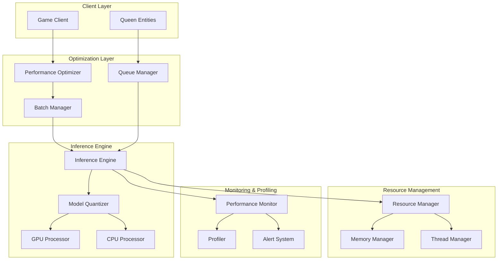
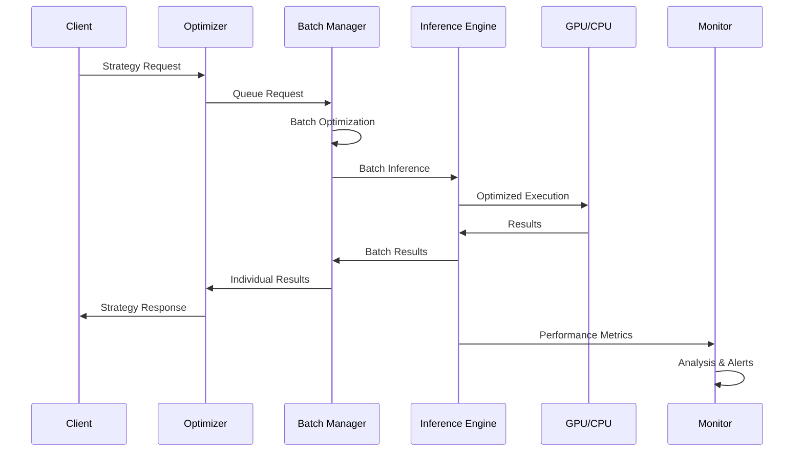

# Neural Network Tuning and Optimization Design

## Overview

The Neural Network Tuning system optimizes the existing Adaptive Queen Intelligence neural network for real-time performance and production deployment. Based on assessment results showing 50ms inference time (target: <16ms for 60fps), this system implements comprehensive performance optimizations including model quantization, batch processing, GPU acceleration, and intelligent resource management while preserving learning quality.

The system addresses critical performance bottlenecks through a multi-layered optimization approach: hardware acceleration, model compression, algorithmic improvements, and intelligent resource management. All optimizations maintain backward compatibility and include fallback mechanisms for robust deployment across diverse hardware configurations.

## Architecture

### High-Level Architecture



### Performance Optimization Pipeline



## Components and Interfaces

### 1. Performance Optimizer

**Purpose**: Central coordination of all performance optimizations and request routing.

**Key Responsibilities**:
- Request prioritization and routing
- Hardware capability detection
- Optimization strategy selection
- Performance target enforcement

**Interface**:
```typescript
interface PerformanceOptimizer {
  optimizeInference(request: InferenceRequest): Promise<OptimizedResponse>
  configureHardware(): HardwareConfig
  selectOptimizationStrategy(context: OptimizationContext): Strategy
  enforcePerformanceTargets(): void
}
```

### 2. Model Quantizer

**Purpose**: Converts neural network models to optimized formats for faster inference.

**Key Responsibilities**:
- Float32 to Int8 quantization
- Model pruning and compression
- Quality validation after optimization
- Fallback to full-precision when needed

**Interface**:
```python
class ModelQuantizer:
    def quantize_model(self, model: tf.keras.Model) -> QuantizedModel
    def prune_model(self, model: tf.keras.Model, sparsity: float) -> PrunedModel
    def validate_quality(self, original: Model, optimized: Model) -> QualityMetrics
    def create_fallback_chain(self) -> List[ModelVariant]
```

### 3. Batch Processor

**Purpose**: Groups multiple inference requests for parallel processing efficiency.

**Key Responsibilities**:
- Intelligent request batching
- Optimal batch size determination
- Parallel processing coordination
- Individual result extraction

**Interface**:
```python
class BatchProcessor:
    def add_request(self, request: InferenceRequest) -> BatchID
    def process_batch(self, batch: RequestBatch) -> BatchResults
    def optimize_batch_size(self, hardware: HardwareConfig) -> int
    def extract_individual_results(self, batch_results: BatchResults) -> List[Result]
```

### 4. GPU Acceleration Manager

**Purpose**: Manages GPU resources and CUDA optimization for maximum performance.

**Key Responsibilities**:
- CUDA stream management
- GPU memory optimization
- Multi-GPU coordination
- Mixed precision configuration

**Interface**:
```python
class GPUManager:
    def configure_cuda_streams(self) -> CUDAConfig
    def optimize_gpu_memory(self) -> MemoryConfig
    def coordinate_multi_gpu(self, gpus: List[GPU]) -> MultiGPUConfig
    def enable_mixed_precision(self) -> PrecisionConfig
```

### 5. Performance Monitor

**Purpose**: Real-time monitoring and profiling of neural network performance.

**Key Responsibilities**:
- Inference time measurement
- Memory usage tracking
- GPU utilization monitoring
- Performance trend analysis

**Interface**:
```python
class PerformanceMonitor:
    def measure_inference_time(self, operation: Callable) -> TimingMetrics
    def track_memory_usage(self) -> MemoryMetrics
    def monitor_gpu_utilization(self) -> GPUMetrics
    def analyze_performance_trends(self) -> TrendAnalysis
```

## Data Models

### Performance Metrics

```python
@dataclass
class PerformanceMetrics:
    inference_time_ms: float
    memory_usage_mb: float
    gpu_utilization_percent: float
    throughput_predictions_per_second: float
    batch_efficiency: float
    quality_score: float
    timestamp: datetime
```

### Optimization Configuration

```python
@dataclass
class OptimizationConfig:
    enable_quantization: bool
    target_inference_time_ms: float
    max_memory_usage_mb: float
    batch_size_range: Tuple[int, int]
    gpu_acceleration: bool
    mixed_precision: bool
    fallback_strategies: List[str]
```

### Hardware Profile

```python
@dataclass
class HardwareProfile:
    cpu_cores: int
    cpu_frequency_ghz: float
    memory_gb: float
    gpu_count: int
    gpu_memory_gb: float
    cuda_capability: Optional[str]
    supports_mixed_precision: bool
```

## Correctness Properties

*A property is a characteristic or behavior that should hold true across all valid executions of a system-essentially, a formal statement about what the system should do. Properties serve as the bridge between human-readable specifications and machine-verifiable correctness guarantees.*

Based on the prework analysis, all acceptance criteria are testable as properties. After reviewing for redundancy, the following properties provide comprehensive validation:

### Property 1: Real-Time Inference Performance
*For any* neural network inference request, the processing time should be less than 16ms when using optimized inference engine
**Validates: Requirements 1.1**

### Property 2: Batch Processing Efficiency
*For any* batch of inference requests, the average processing time per request should remain under 16ms regardless of batch size
**Validates: Requirements 1.2, 3.1, 3.2**

### Property 3: GPU Acceleration Effectiveness
*For any* inference operation, when GPU acceleration is available, the speedup over CPU should be at least 3x
**Validates: Requirements 1.3, 5.1**

### Property 4: Model Quantization Quality Preservation
*For any* neural network model, quantization from float32 to int8 should maintain >95% of original prediction accuracy
**Validates: Requirements 2.1, 2.5, 6.3**

### Property 5: Memory Management Bounds
*For any* system operation, memory usage should remain within allocated limits (<200MB) without performance degradation
**Validates: Requirements 1.5, 8.2, 8.3**

### Property 6: Throughput Performance Target
*For any* batch processing scenario, the system should achieve >100 predictions per second throughput
**Validates: Requirements 3.3**

### Property 7: Hardware Optimization Adaptation
*For any* hardware configuration change, the system should automatically reconfigure optimization settings for optimal performance
**Validates: Requirements 5.5, 7.1**

### Property 8: Learning Quality Preservation
*For any* performance optimization applied, the neural network learning progression should remain stable or improve
**Validates: Requirements 6.1, 6.4**

### Property 9: Fallback Reliability
*For any* optimization failure scenario, the system should gracefully fallback to alternative methods without service interruption
**Validates: Requirements 2.4, 3.4, 6.5**

### Property 10: Performance Monitoring Accuracy
*For any* neural network operation, all performance metrics (time, memory, GPU utilization) should be accurately measured and recorded
**Validates: Requirements 4.1, 4.3**

## Error Handling

### Optimization Failure Recovery

1. **Quantization Failures**: Automatic fallback to full-precision models with performance warnings
2. **GPU Unavailability**: Seamless CPU fallback with optimized threading and SIMD instructions
3. **Memory Pressure**: Intelligent garbage collection and request throttling
4. **Batch Processing Errors**: Individual request processing as backup

### Performance Degradation Response

1. **Inference Time Violations**: Automatic optimization strategy adjustment
2. **Memory Limit Breaches**: Immediate resource cleanup and request queuing
3. **GPU Errors**: Instant CPU fallback with minimal service disruption
4. **Quality Degradation**: Rollback to previous optimization configuration

### Monitoring and Alerting

1. **Real-time Performance Tracking**: Continuous monitoring of all performance metrics
2. **Threshold-based Alerts**: Immediate notifications when targets are missed
3. **Trend Analysis**: Proactive identification of performance degradation patterns
4. **Diagnostic Recommendations**: Automated suggestions for performance improvements

## Testing Strategy

### Dual Testing Approach

The system requires both unit testing and property-based testing for comprehensive validation:

**Unit Tests**: Verify specific optimization scenarios, edge cases, and error conditions
- Model quantization accuracy validation
- GPU/CPU fallback mechanisms
- Memory management under pressure
- Batch processing edge cases

**Property Tests**: Verify universal performance properties across all inputs
- Inference time bounds across all request types
- Memory usage limits under all conditions
- Throughput targets across all batch sizes
- Quality preservation across all optimizations

### Property-Based Testing Configuration

- **Minimum 100 iterations** per property test (due to performance variability)
- **TensorFlow/PyTorch integration** for realistic neural network operations
- **Hardware simulation** for testing across different configurations
- **Performance regression detection** through automated benchmarking

Each property test references its design document property:
- **Tag format**: `Feature: neural-network-tuning, Property {number}: {property_text}`
- **Performance measurement**: All tests include timing and resource usage validation
- **Quality verification**: Learning effectiveness maintained across optimizations

### Testing Framework Integration

**Python Backend**: pytest with Hypothesis for property-based testing
**Performance Testing**: Custom benchmarking framework with TensorFlow profiling
**Hardware Testing**: Automated testing across CPU-only, single GPU, and multi-GPU configurations
**Integration Testing**: End-to-end performance validation with real game scenarios