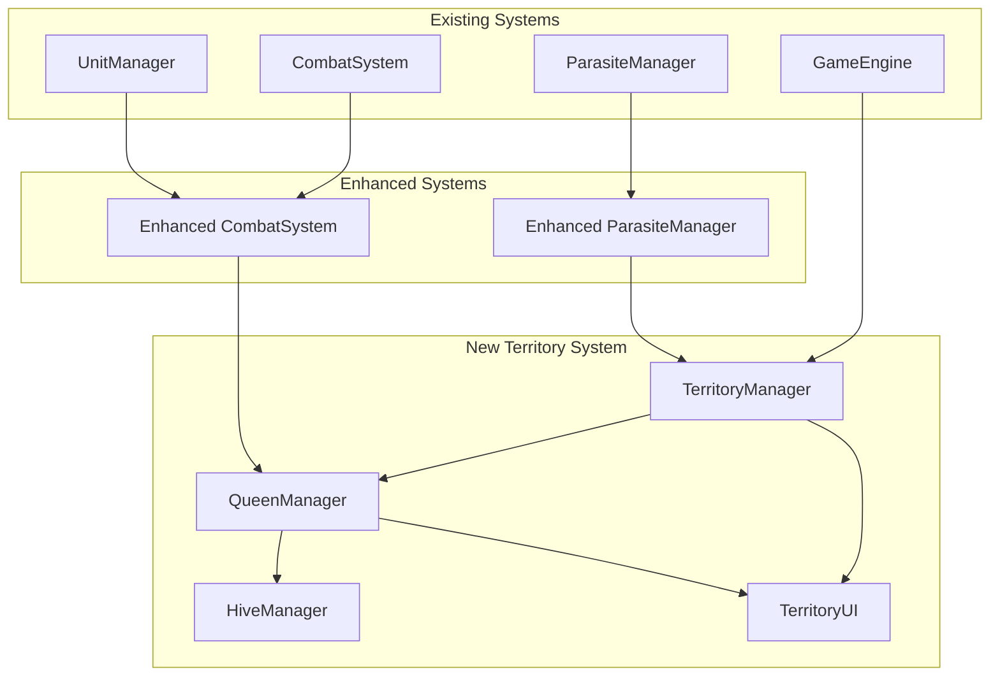
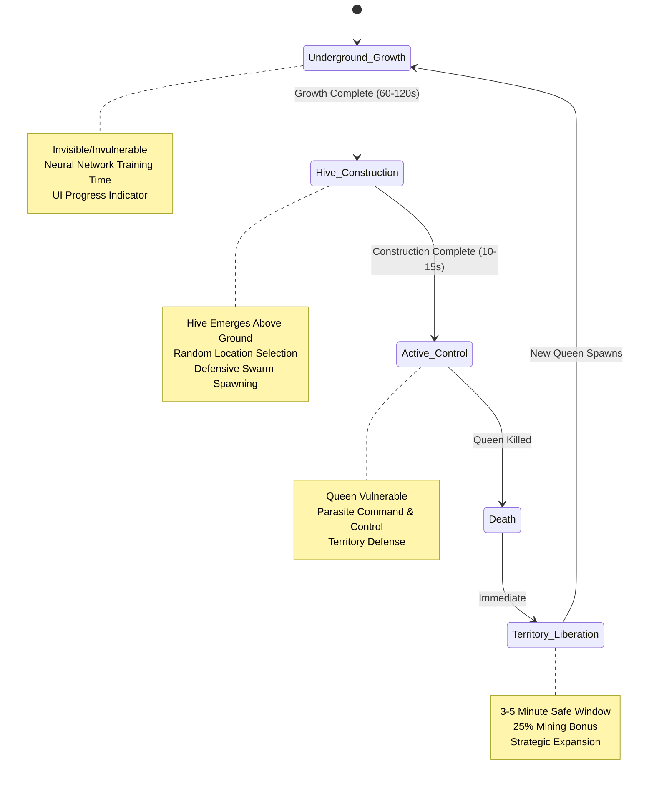

# Design Document

## Overview

The Queen & Territory System transforms Nexus of Mind from scattered parasite encounters into organized territorial warfare. This system introduces Queen entities that control 16x16 chunk territories (1024x1024 units), managing parasite swarms and creating high-stakes hive assault missions. The design builds directly on the existing Enhanced Parasite System and integrates seamlessly with current game architecture including ParasiteManager, CombatSystem, and UnitManager.

The system creates a foundation for Phase 3 neural network learning by establishing clear territorial boundaries, Queen lifecycle events, and data collection points for AI behavior analysis.

## Architecture

### System Integration Overview



### Territory Grid Architecture

The territory system divides the game world into a grid of 16x16 chunk territories, where each chunk is 64x64 units. This creates territories of 1024x1024 units each, providing substantial areas for Queen control while maintaining performance.

```typescript
// Territory grid calculation
const CHUNK_SIZE = 64; // units per chunk
const TERRITORY_SIZE_CHUNKS = 16; // chunks per territory
const TERRITORY_SIZE_UNITS = CHUNK_SIZE * TERRITORY_SIZE_CHUNKS; // 1024 units
```

### Queen Lifecycle State Machine

Queens follow a deterministic lifecycle that provides clear phases for player interaction and future AI learning integration:



## Components and Interfaces

### TerritoryManager

Central coordinator for all territorial operations, managing the grid system and territory lifecycle.

```typescript
export interface Territory {
    id: string;
    centerPosition: Vector3;
    size: number; // 1024 units
    chunkBounds: ChunkBounds;
    queen: Queen | null;
    hive: Hive | null;
    controlStatus: 'queen_controlled' | 'liberated' | 'contested';
    liberationTimer: number; // seconds remaining
    liberationStartTime: number;
    parasiteCount: number;
}

export class TerritoryManager {
    private territories: Map<string, Territory> = new Map();
    private territoryGrid: TerritoryGrid;
    private gameEngine: GameEngine;
    
    // Territory constants
    private readonly TERRITORY_SIZE_CHUNKS = 16;
    private readonly CHUNK_SIZE = 64;
    private readonly TERRITORY_SIZE_UNITS = 1024;
    
    // Liberation mechanics
    private readonly LIBERATION_DURATION_MIN = 180; // 3 minutes
    private readonly LIBERATION_DURATION_MAX = 300; // 5 minutes
    private readonly LIBERATION_MINING_BONUS = 0.25; // 25% faster mining
    
    public createTerritory(centerX: number, centerZ: number): Territory;
    public getTerritoryAt(x: number, z: number): Territory | null;
    public liberateTerritory(territoryId: string): void;
    public isPositionInTerritory(position: Vector3, territoryId: string): boolean;
    public getTerritoriesInRange(position: Vector3, radius: number): Territory[];
    public update(deltaTime: number): void;
}
```

### Queen Entity System

Queens are powerful stationary entities that control territorial parasites and follow a structured lifecycle.

```typescript
export enum QueenPhase {
    UNDERGROUND_GROWTH = 'underground_growth',
    HIVE_CONSTRUCTION = 'hive_construction', 
    ACTIVE_CONTROL = 'active_control'
}

export interface QueenConfig {
    territory: Territory;
    generation: number; // For future AI learning
    growthDuration: number; // 60-120 seconds
    health: number; // 40-100 hits
}

export class Queen implements CombatTarget {
    private id: string;
    private territory: Territory;
    private hive: Hive | null = null;
    private currentPhase: QueenPhase;
    private health: number;
    private maxHealth: number;
    private generation: number;
    
    // Growth phase tracking
    private growthStartTime: number;
    private growthDuration: number;
    private growthProgress: number; // 0.0 to 1.0
    
    // Parasite control
    private controlledParasites: Set<string> = new Set();
    private spawnStrategy: ParasiteSpawnStrategy;
    
    constructor(config: QueenConfig);
    
    public update(deltaTime: number): void;
    public takeDamage(damage: number): boolean; // CombatTarget interface
    public onDestroyed(): void; // CombatTarget interface
    
    // Lifecycle management
    private startGrowthPhase(): void;
    private updateGrowthPhase(deltaTime: number): void;
    private startHiveConstruction(): void;
    private updateConstructionPhase(deltaTime: number): void;
    private updateControlPhase(deltaTime: number): void;
    
    // Parasite control
    public addControlledParasite(parasiteId: string): void;
    public removeControlledParasite(parasiteId: string): void;
    public getControlledParasites(): string[];
    
    // Territory management
    public isVulnerable(): boolean;
    public getTerritory(): Territory;
    public getHive(): Hive | null;
}
```

### Hive Structure System

Hives are the physical manifestation of Queen control, providing targetable structures for player assault missions.

```typescript
export interface HiveConfig {
    position: Vector3;
    territory: Territory;
    queen: Queen;
    health: number; // 20-30 hits
    constructionDuration: number; // 10-15 seconds
}

export class Hive implements CombatTarget {
    private id: string;
    private position: Vector3;
    private territory: Territory;
    private queen: Queen;
    private health: number;
    private maxHealth: number;
    
    // Construction tracking
    private isConstructed: boolean = false;
    private constructionStartTime: number;
    private constructionDuration: number;
    private constructionProgress: number; // 0.0 to 1.0
    
    // Defensive systems
    private defensiveParasites: string[] = [];
    private swarmSize: number; // 50+ parasites
    
    constructor(config: HiveConfig);
    
    public update(deltaTime: number): void;
    public takeDamage(damage: number): boolean; // CombatTarget interface
    public onDestroyed(): void; // CombatTarget interface
    
    // Construction management
    public startConstruction(): void;
    private updateConstruction(deltaTime: number): void;
    private completeConstruction(): void;
    
    // Defensive systems
    private spawnDefensiveSwarm(): void;
    private updateDefensiveSwarm(): void;
    public getDefensiveParasites(): string[];
    
    // Status queries
    public isConstructed(): boolean;
    public getConstructionProgress(): number;
    public getPosition(): Vector3;
}
```

### Enhanced ParasiteManager Integration

The existing ParasiteManager is enhanced to work with territorial control, allowing Queens to manage parasite spawning within their territories.

```typescript
export interface TerritorialParasiteConfig {
    territory: Territory;
    queen: Queen | null;
    spawnStrategy: 'defensive' | 'aggressive' | 'balanced';
    spawnRate: number; // Multiplier for base spawn rate
}

// Enhanced ParasiteManager methods
export class EnhancedParasiteManager extends ParasiteManager {
    private territoryManager: TerritoryManager;
    private territorialConfigs: Map<string, TerritorialParasiteConfig> = new Map();
    
    public setTerritoryManager(territoryManager: TerritoryManager): void;
    public configureTerritorialSpawning(territoryId: string, config: TerritorialParasiteConfig): void;
    
    // Override spawning to respect territorial control
    protected updateSpawning(deposit: MineralDeposit, workers: Worker[], currentTime: number): void;
    protected shouldSpawnInTerritory(territory: Territory): boolean;
    protected getSpawnRateForTerritory(territory: Territory): number;
    
    // Territory-specific parasite management
    public explodeParasitesInTerritory(territoryId: string): void;
    public getParasitesInTerritory(territoryId: string): (EnergyParasite | CombatParasite)[];
    public transferParasiteControl(parasiteId: string, newQueen: Queen): void;
}
```

### Enhanced CombatSystem Integration

The CombatSystem is enhanced to handle Queen and Hive combat, including multi-protector coordination for hive assaults.

```typescript
// Enhanced CombatSystem methods
export class EnhancedCombatSystem extends CombatSystem {
    private territoryManager: TerritoryManager;
    
    public setTerritoryManager(territoryManager: TerritoryManager): void;
    
    // Queen/Hive combat handling
    public validateQueenTarget(protector: Protector, queen: Queen): TargetValidation;
    public validateHiveTarget(protector: Protector, hive: Hive): TargetValidation;
    
    // Multi-protector hive assault coordination
    public coordinateHiveAssault(hive: Hive, protectors: Protector[]): AssaultResult;
    public calculateHiveAssaultDamage(hive: Hive, protectors: Protector[]): number;
    
    // Territory-aware target prioritization
    public prioritizeTargetsWithTerritory(protector: Protector, targets: CombatTarget[]): CombatTarget[];
    public getDefensivePriorityInTerritory(territory: Territory): number;
}
```

## Data Models

### Territory Grid System

```typescript
export interface ChunkBounds {
    minX: number;
    maxX: number;
    minZ: number;
    maxZ: number;
    chunkCoords: { x: number, z: number }[];
}

export class TerritoryGrid {
    private gridSize: number; // Territory size in chunks (16)
    private chunkSize: number; // Chunk size in units (64)
    private territories: Map<string, Territory> = new Map();
    
    public getTerritoryCoordsAt(x: number, z: number): { territoryX: number, territoryZ: number };
    public getTerritoryIdAt(x: number, z: number): string;
    public calculateChunkBounds(centerX: number, centerZ: number): ChunkBounds;
    public getNeighboringTerritories(territoryId: string): Territory[];
    public isPositionInTerritory(position: Vector3, territory: Territory): boolean;
}
```

### Queen Memory System (Phase 3 Preparation)

```typescript
export interface QueenMemory {
    generation: number;
    previousDeaths: DeathRecord[];
    playerPatterns: PlayerBehaviorData;
    territoryHistory: TerritoryControlData;
    learningData: any; // Placeholder for neural network data
}

export interface DeathRecord {
    timestamp: number;
    location: Vector3;
    cause: 'protector_assault' | 'coordinated_attack' | 'worker_infiltration';
    timeAlive: number;
    parasitesSpawned: number;
    playerUnitsNearby: { protectors: number, workers: number };
    hiveDiscoveryTime: number;
    assaultPattern: string;
}

export interface PlayerBehaviorData {
    preferredMiningLocations: Vector3[];
    assaultTimingPatterns: number[];
    unitComposition: { workers: number, protectors: number };
    energyManagementStyle: 'conservative' | 'aggressive' | 'balanced';
    explorationPatterns: string[];
}
```

### Territory Liberation System

```typescript
export interface LiberationStatus {
    isLiberated: boolean;
    liberationStartTime: number;
    liberationDuration: number;
    timeRemaining: number;
    miningBonus: number; // 0.25 for 25% bonus
    energyReward: number; // 50-100 energy for Queen kill
}

export class LiberationManager {
    private activeLiberations: Map<string, LiberationStatus> = new Map();
    private energyManager: EnergyManager;
    
    public startLiberation(territoryId: string, duration: number): void;
    public updateLiberations(deltaTime: number): void;
    public isTerritorLiberated(territoryId: string): boolean;
    public getLiberationStatus(territoryId: string): LiberationStatus | null;
    public getMiningBonusAt(position: Vector3): number;
}
```

## Correctness Properties

*A property is a characteristic or behavior that should hold true across all valid executions of a system-essentially, a formal statement about what the system should do. Properties serve as the bridge between human-readable specifications and machine-verifiable correctness guarantees.*

After analyzing the acceptance criteria, I've identified the following testable properties. Several properties were consolidated to eliminate redundancy where one property implies another.

### Property 1: Territory Grid Mathematical Correctness
*For any* world position, the territory calculation should map to exactly one territory with correct 16x16 chunk boundaries aligned to the 64-unit chunk system
**Validates: Requirements 1.1, 1.2, 1.5**

### Property 2: Territory Non-Overlap Constraint  
*For any* pair of territories in the system, their boundaries should never overlap with each other
**Validates: Requirements 1.3**

### Property 3: Queen Health Constraints
*For any* Queen instance, its health should be between 40-100 hits and remain within the 10x-20x parasite health range
**Validates: Requirements 2.1**

### Property 4: Queen Stationary Behavior
*For any* Queen after hive construction, its position should never change throughout its lifecycle
**Validates: Requirements 2.2**

### Property 5: Queen Parasite Control Authority
*For any* parasite within a territory, it should be controlled by that territory's Queen when the Queen is in active control phase
**Validates: Requirements 2.3**

### Property 6: Queen Vulnerability State Management
*For any* Queen during underground growth or hive construction phases, damage attempts should be rejected (invulnerable state)
**Validates: Requirements 2.4, 4.7**

### Property 7: Queen Death Territory Liberation
*For any* Queen death event, all parasites in that territory should be immediately destroyed and the territory should enter liberation status
**Validates: Requirements 2.6, 4.1, 4.2**

### Property 8: Hive Health Constraints
*For any* Hive instance, its health should be between 20-30 hits and separate from its Queen's health tracking
**Validates: Requirements 3.1**

### Property 9: Hive Defensive Swarm Spawning
*For any* completed hive construction, the system should spawn 50 or more parasites of both Energy and Combat types for defense
**Validates: Requirements 3.2**

### Property 10: Hive Territorial Placement
*For any* hive placement, the hive position should be within its territory's boundaries
**Validates: Requirements 3.3**

### Property 11: Hive Construction Timing
*For any* hive construction process, the emergence time should be between 10-15 seconds
**Validates: Requirements 3.4**

### Property 12: Hive Destruction Liberation Chain
*For any* hive destruction event, the Queen should be killed and the territory should be liberated
**Validates: Requirements 3.6**

### Property 13: Queen Regeneration Lifecycle
*For any* Queen death, a new Queen should begin growing underground in an invisible and invulnerable state
**Validates: Requirements 4.3**

### Property 14: Queen Growth Phase Timing
*For any* Queen growth phase, the duration should be between 60-120 seconds
**Validates: Requirements 4.4**

### Property 15: Growth Completion Hive Selection
*For any* Queen reaching 100% growth, the system should select a random hive location within the territory and begin construction
**Validates: Requirements 4.6**

### Property 16: Liberation Period Mining Bonus
*For any* mining operation during a territory liberation period, the mining speed should be 25% faster than normal
**Validates: Requirements 5.2**

### Property 17: Queen Kill Energy Rewards
*For any* Queen kill event, the player should receive energy rewards between 50-100 energy
**Validates: Requirements 5.4**

### Property 18: Hive Assault Difficulty Scaling
*For any* single protector attempting to destroy a hive, the assault should require significant time and energy, encouraging multi-protector coordination
**Validates: Requirements 6.3**

### Property 19: Existing Parasite System Preservation
*For any* existing parasite spawning and behavior mechanics, they should continue to function correctly after territory system integration
**Validates: Requirements 8.4**

## Error Handling

### Territory System Error Recovery

**Territory Overlap Detection**: If territories are detected to overlap due to calculation errors, the system should automatically recalculate boundaries and log the error for debugging.

**Queen Lifecycle Corruption**: If a Queen enters an invalid state (e.g., vulnerable during growth phase), the system should reset the Queen to the appropriate phase based on hive construction status.

**Hive Construction Failures**: If hive construction fails or times out, the system should retry construction at a new random location within the territory.

**Parasite Control Inconsistencies**: If parasites are found outside their Queen's territory control, they should be automatically transferred to the correct territorial Queen or destroyed if no Queen exists.

### Performance Degradation Handling

**Memory Usage Monitoring**: If territory system memory usage exceeds 100MB, the system should reduce the number of active territories and log performance warnings.

**Frame Rate Protection**: If frame rate drops below 50fps during Queen lifecycle transitions, the system should temporarily disable non-essential visual effects and reduce update frequencies.

**Combat System Integration Failures**: If the enhanced CombatSystem fails to handle Queen/Hive targets, the system should fall back to basic damage application without special effects.

### Data Consistency Safeguards

**Territory-Queen Relationship Validation**: Regular validation ensures each territory has at most one Queen and each Queen belongs to exactly one territory.

**Liberation Timer Synchronization**: Liberation timers are validated against server time to prevent client-side manipulation and ensure consistent liberation periods.

**Parasite Count Reconciliation**: Periodic reconciliation ensures parasite counts match between TerritoryManager and ParasiteManager to prevent spawning inconsistencies.

## Testing Strategy

### Dual Testing Approach

The Queen & Territory System requires both **unit tests** and **property-based tests** to ensure comprehensive coverage:

- **Unit tests**: Verify specific examples, edge cases, and integration points
- **Property tests**: Verify universal properties across all inputs using randomized testing
- **Integration tests**: Validate system interactions with existing ParasiteManager, CombatSystem, and UnitManager

### Property-Based Testing Configuration

**Testing Framework**: Use **fast-check** for TypeScript property-based testing with minimum 100 iterations per property test.

**Test Tagging**: Each property test must reference its design document property using the format:
```typescript
// Feature: queen-territory-system, Property 1: Territory Grid Mathematical Correctness
```

**Property Test Examples**:

```typescript
// Property 1: Territory Grid Mathematical Correctness
fc.test('territory grid calculations', fc.record({
    x: fc.integer(-10000, 10000),
    z: fc.integer(-10000, 10000)
}), (coords) => {
    const territory = territoryManager.getTerritoryAt(coords.x, coords.z);
    const territoryCoords = territoryGrid.getTerritoryCoordsAt(coords.x, coords.z);
    
    // Verify territory size is exactly 1024x1024 units
    expect(territory.size).toBe(1024);
    
    // Verify boundaries align with 64-unit chunks
    expect(territory.chunkBounds.minX % 64).toBe(0);
    expect(territory.chunkBounds.maxX % 64).toBe(0);
    expect(territory.chunkBounds.minZ % 64).toBe(0);
    expect(territory.chunkBounds.maxZ % 64).toBe(0);
    
    // Verify territory contains exactly 16x16 chunks
    const chunkCount = territory.chunkBounds.chunkCoords.length;
    expect(chunkCount).toBe(256); // 16 * 16
});

// Property 7: Queen Death Territory Liberation  
fc.test('queen death liberation', fc.record({
    territoryId: fc.string(),
    parasiteCount: fc.integer(1, 20)
}), (data) => {
    // Setup territory with Queen and parasites
    const territory = createTestTerritory(data.territoryId);
    const queen = createTestQueen(territory);
    const parasites = createTestParasites(data.parasiteCount, territory);
    
    // Kill the Queen
    queen.takeDamage(queen.maxHealth);
    
    // Verify all parasites in territory are destroyed
    const remainingParasites = territoryManager.getParasitesInTerritory(data.territoryId);
    expect(remainingParasites.length).toBe(0);
    
    // Verify territory is liberated
    expect(territory.controlStatus).toBe('liberated');
    expect(territory.liberationTimer).toBeGreaterThan(180); // 3+ minutes
});
```

### Unit Testing Focus Areas

**Territory Grid Calculations**: Test boundary calculations, coordinate mapping, and chunk alignment with specific known values.

**Queen Lifecycle Transitions**: Test each phase transition with controlled timing and state validation.

**Hive Construction Process**: Test construction timing, defensive swarm spawning, and vulnerability state changes.

**Combat System Integration**: Test Queen/Hive targeting, damage application, and multi-protector coordination.

**UI Component Updates**: Test Queen growth progress display, liberation timer countdown, and territory boundary indicators.

### Integration Testing Scenarios

**Existing System Compatibility**: Verify that existing parasite spawning, combat mechanics, and unit management continue to work correctly.

**Performance Under Load**: Test system performance with multiple active territories, Queens in different lifecycle phases, and large defensive swarms.

**Cross-System Communication**: Validate proper event propagation between TerritoryManager, ParasiteManager, CombatSystem, and UI components.

**Error Recovery Testing**: Test system behavior under various failure conditions including Queen state corruption, hive construction failures, and memory pressure.

<function_calls>
<invoke name="prework">
<parameter name="featureName">queen-territory-system