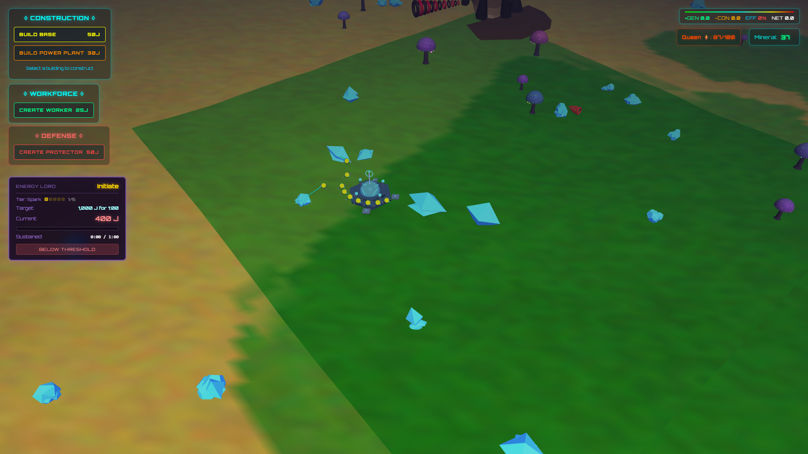
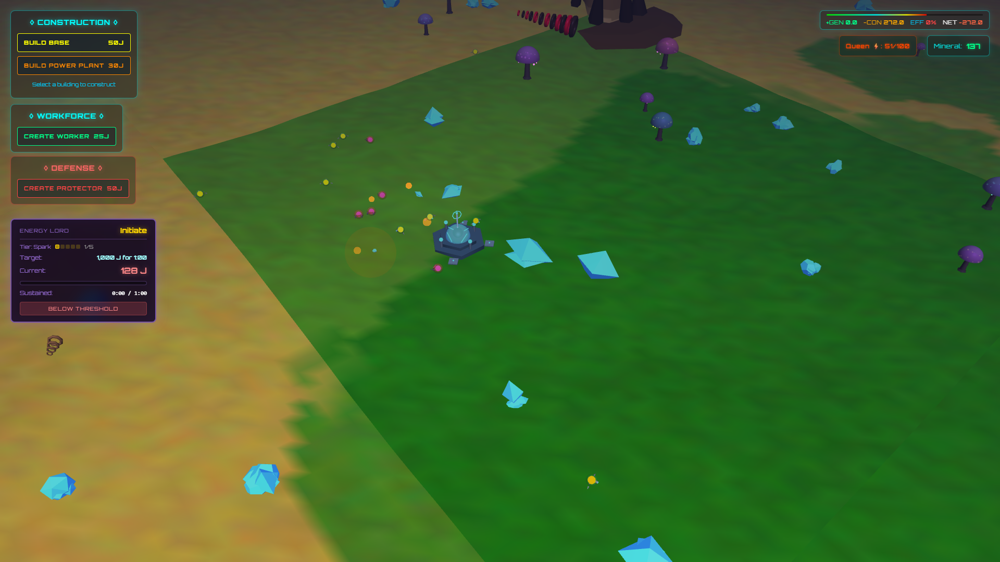
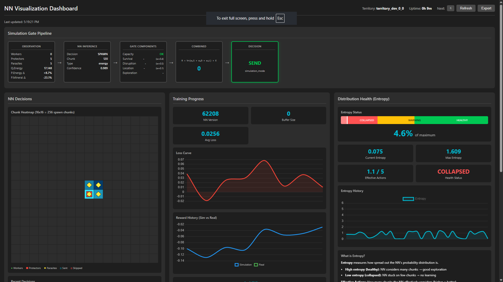

# Nexus of Mind

A real-time strategy game where you mine resources and defend against AI-controlled creatures that learn and adapt to your strategies through neural network training.


[Watch Demo Video](https://youtu.be/OhX_kAqxR-4)

---

## Innovation Highlights

| Feature | Description |
|---------|-------------|
| **Adaptive AI** | Five-NN Sequential Architecture (~830 params) that learns from every player interaction |
| **Simulation-Gated Inference** | AI evaluates decisions before execution using predictive cost functions |
| **Generational Evolution** | Each game session trains the next generation - the AI genuinely improves |
| **Real-time Learning** | Dual feedback loop (simulation + real game) enables continuous adaptation |
| **Lightweight Design** | Full neural network runs smoothly on CPU - no GPU required for gameplay |

---

## Quick Demo

### Resource Mining
Workers harvest minerals and deliver them to Power Plants for energy conversion.



### Combat System
Protectors auto-engage parasites. The Queen AI adapts spawn patterns based on your defenses.



### Base Building
Construct Power Plants to convert minerals into energy. All operations consume energy.


---

## Prerequisites

### Tech Stack
- **Frontend**: Babylon.js 6.x (3D WebGL), TypeScript 5.x, Webpack 5.x
- **Backend**: Python 3.12+, PyTorch, FastAPI, WebSocket
- **GPU**: Optional - NVIDIA CUDA 12.x for accelerated training (CPU works fine for gameplay)
- **Browser**: WebGL 2.0 compatible (Chrome, Firefox, Edge, Safari)

### Core Dependencies
- **Babylon.js**: 3D engine, scene management, WebGL abstraction
- **PyTorch**: Neural network training and inference
- **Node.js 18+**: Build toolchain and development server

### Environment Requirements
- 60fps target performance
- Memory footprint: ~100-200MB (client + server)
- WebSocket connectivity for AI backend
- GPU optional (model is only ~830 parameters)

---

## Quick Start

### Windows (Recommended)
```bash
# Install dependencies
install.bat

# Start servers
start.bat
```

### Manual Setup
```bash
# Backend
pip install -r requirements.txt
cd server && python start_server.py

# Frontend (separate terminal)
npm install && npm run dev
```

### Docker
```bash
docker-compose up --build
```

### URLs
| Service | URL |
|---------|-----|
| Game Client | http://localhost:3010 |
| AI Backend | http://localhost:8010 |

---

## How to Play

> Press **H** in-game to open the help window.

### Navigation

**Camera Movement:**
| Key | Action |
|-----|--------|
| W / Arrow Up | Move camera forward |
| S / Arrow Down | Move camera backward |
| A / Arrow Left | Rotate camera left |
| D / Arrow Right | Rotate camera right |

**Zoom & View:**
| Control | Action |
|---------|--------|
| Mouse Wheel | Zoom in/out |
| Mouse Drag | Rotate camera view |
| H | Open help window |
| Escape | Close help / Cancel action |

### Operations

**Construction:**
1. Click a building button in the panel
2. Move mouse to preview placement location
3. Left-click to place (requires energy)

**Energy Production:**
Minerals hold immense energy potential. Only **Power Plants** can convert harvested minerals into usable energy. Keep your workforce mining continuously, and deploy Power Plants strategically to maintain a steady energy flow.

**Units:**
| Unit | Description |
|------|-------------|
| Workforce (Worker) | Created from Base, mine minerals |
| Protector | Created from Base, combat units |

**Unit Movement:**
| Action | Result |
|--------|--------|
| Left-click unit | Select the unit |
| Left-click mineral | Move worker to mine |
| Left-click terrain | Move protector (auto-attacks enemies) |
| Right-click | View information tooltip |

**Caution:** Nearly all operations consume energy. Monitor the energy bar at the top of your display.

### Enemies

**Parasite Types (creatures):**

| Type | Spawn Rate | Behavior | Health | Speed | Kill Reward |
|------|------------|----------|--------|-------|-------------|
| Energy Parasite | 75% | Targets workers, steals energy | 60 HP | 4.0 | +2 energy |
| Combat Parasite | 25% | Aggressive, targets protectors | 100 HP | 5.0 | +4 energy |

**Parasite States:** SPAWNING → PATROLLING → HUNTING → FEEDING → RETURNING

**Strategy Tips:**
- Keep Protectors near your Workers
- Parasites spawn near mining activity
- Parasites will chase workers
- Combat Parasites (larger, red) destroy protectors
- The Queen AI adapts to your tactics over time

### Game Objective

No traditional "victory" - perpetual strategic challenge against evolving AI:
- Survive against increasingly adaptive parasite swarms
- Maximize energy extraction efficiency
- Advance through 60 levels of the Energy Lords progression
- Adapt strategies as the Queen AI learns yours

---

## Progression System (Energy Lords)

Players advance through **60 levels** organized into **12 tiers** by sustaining energy production above thresholds.

| Tier | Levels | Title | Sustain Time | Energy Range |
|------|--------|-------|--------------|--------------|
| Spark | 1-5 | Spark I-V | 1 min | 1,000 - 1,360 J |
| Ember | 6-10 | Ember I-V | 2 min | 1,469 - 1,999 J |
| Flame | 11-15 | Flame I-V | 3 min | 2,159 - 2,937 J |
| Blaze | 16-20 | Blaze I-V | 4 min | 3,172 - 4,316 J |
| Inferno | 21-25 | Inferno I-V | 5 min | 4,661 - 6,341 J |
| Nova | 26-30 | Nova I-V | 7 min | 6,848 - 9,317 J |
| Pulsar | 31-35 | Pulsar I-V | 9 min | 10,063 - 13,690 J |
| Quasar | 36-40 | Quasar I-V | 11 min | 14,785 - 20,115 J |
| Nebula | 41-45 | Nebula I-V | 13 min | 21,725 - 29,560 J |
| Star | 46-50 | Star I-V | 14 min | 31,924 - 43,427 J |
| Supernova | 51-55 | Supernova I-V | 15 min | 46,901 - 63,800 J |
| Nexus | 56-60 | Nexus I-V | 15 min | 68,904 - 93,749 J |

**How it works:**
- Energy threshold formula: `1000 × 1.08^(level-1)` Joules
- Energy checked every 500ms
- If energy drops below threshold, timer resets to zero
- Victory triggers when sustained time reaches required duration

**Upgrade Bonuses:**
- Regular level completion: +1% power generator bonus
- Tier completion (every 5th level): +3.5% bonus
- Maximum total bonus at level 60: 90%

**Persistence:** Progress saved to SQLite database via backend API. Survives browser sessions.

---

## Architecture

### High-Level Overview

```
┌─────────────────────────────────────────────────────────────────┐
│                     GAME CLIENT (Babylon.js)                    │
│  GameEngine → SceneManager, CameraController, TerrainSystem,    │
│  UnitManager, ParasiteManager, EnergyManager, BuildingSystem,   │
│  CombatSystem, TerritoryManager, EnergyLordsProgression, UI     │
└─────────────────────────┬───────────────────────────────────────┘
                          │ WebSocket (ws://localhost:8010)
                          ↓
┌─────────────────────────────────────────────────────────────────┐
│              AI BACKEND (Python + PyTorch)                      │
│  WebSocket Server → Feature Extractor → SequentialQueenNN       │
│  (5 networks) → Simulation Gate → Strategy Generator → Trainer  │
└─────────────────────────────────────────────────────────────────┘
```

### Client Folder Structure
```
client/src/
├── game/          # GameEngine.ts, game-state.ts, types.ts
├── engine/        # SceneManager, CameraController, MaterialManager
├── world/         # TerrainSystem, TreeRenderer, MineralDeposit
├── units/         # Unit, Worker, Protector, UnitManager
├── parasites/     # Parasite, EnergyParasite, CombatParasite, ParasiteManager
├── buildings/     # Building, Base, PowerPlant, BuildingSystem
├── territories/   # TerritoryManager, Queen, Hive
├── combat/        # CombatSystem, CombatUI, effects/
├── economy/       # EnergyManager, energy-ui
├── ui/            # All UI components (HUD, Help, Intro, Debug)
└── main.ts        # Entry point
```

### Backend Folder Structure
```
server/
├── ai_engine/
│   ├── nn_model.py              # PyTorch SequentialQueenNN (Five-NN)
│   ├── feature_extractor.py     # Observation → NN features
│   ├── reward_calculator.py     # Outcome evaluation
│   ├── decision_gate/           # Simulation-gated inference
│   │   ├── gate.py              # Gate logic
│   │   ├── cost_function.py     # Expected reward calculation
│   │   ├── config.py            # Gate configuration
│   │   └── components/          # Survival, disruption, location
│   └── training/                # Continuous learning
├── websocket/
│   ├── message_handler.py       # WebSocket message processing
│   └── connection_manager.py    # Client connections
├── routes/                      # REST endpoints
├── database/                    # SQLite for progress
├── models/
│   ├── queen_sequential.pt      # 5-network checkpoint
│   └── queen_sequential_metadata.json
└── main.py                      # FastAPI application
```

### Key Components

| Component | Purpose |
|-----------|---------|
| GameEngine | Central coordinator, 60fps render loop, system orchestration |
| TerrainSystem | Procedural infinite terrain via Perlin noise, chunk-based loading |
| TerritoryManager | 16x16 chunk territories, Queen lifecycle, parasite spawning |
| CombatSystem | Auto-attack mechanics, damage resolution, energy cost validation |
| EnergyManager | Global energy pool, mining conversion, action validation |
| ParasiteManager | NN-driven spawn types, behavior state machine |
| SequentialQueenNN | 5 specialized neural networks for spawn decisions |

---

## Game Engine Deep Dive

### 3D Rendering (Babylon.js)
- WebGL 2.0 rendering
- Low poly SciFi aesthetic with flat shading
- Dynamic lighting: Directional (sun) + ambient
- Performance targets: 60fps, <50 draw calls, <100MB memory

### Procedural Terrain
- Infinite generation using Perlin noise (deterministic seed)
- Chunk-based loading: 64x64 unit chunks, 7×7 grid around camera
- 3 biomes by height: Green (0-3), Yellow (3-6), Brown (6+)
- LOD system, frustum culling, efficient disposal
- Trees: ~400+ with GPU-accelerated glow pulsing

### Unit System

**Workers:**
| Stat | Value |
|------|-------|
| Health | 60 HP |
| Energy Capacity | 50 |
| Movement Speed | 4.0 |
| Mining Range | 3 units |
| Mining Energy Cost | 0.4 per action |
| Flee Distance | 25 units (when attacked) |

**Protectors:**
| Stat | Value |
|------|-------|
| Health | 80 HP |
| Energy Capacity | 60 |
| Movement Speed | 7.0 |
| Detection Range | 12 units |
| Attack Range | 12 units |
| Attack Damage | 35 |
| Attack Energy Cost | 1 per attack |
| Attack Cooldown | 1.5 seconds |

### Parasite System

**Spawn Distribution:**
- **NN-controlled**: Neural network (NN3) decides spawn type
- **Default fallback**: 75% Energy / 25% Combat

**Parasite Stats:**
| Type | Health | Target | Speed | Scale | Reward |
|------|--------|--------|-------|-------|--------|
| Energy | 60 HP | Workers | 4.0 | 1.0x | 2 energy |
| Combat | 100 HP | Protectors → Workers | 5.0 | 1.2x | 4 energy |

### The Queen

The Queen is the visual representation of the neural network - she's **non-interactive**. You don't fight her directly; she orchestrates parasite spawning behavior behind the scenes. Code exists for lifecycle phases (UNDERGROUND_GROWTH, HIVE_CONSTRUCTION, ACTIVE_CONTROL) but these are for NN training context, not active gameplay.

### Combat System

**Flow:** Detection (12 units) → Prioritization → Movement → Attack (12 units) → Resolution

**Energy Economics:**
| Action/Event | Energy |
|--------------|--------|
| Protector attack | -1 |
| Energy Parasite kill | +2 |
| Combat Parasite kill | +4 |
| Worker killed by enemy | +15 (to enemy) |
| Protector killed by enemy | +20 (to enemy) |

### Performance Optimizations
- Combat material disposal
- Eliminated duplicate UI textures
- Synchronous render loop (no async stalls)
- Round-robin system throttling (EnergyManager 10Hz, TerritoryManager 10Hz)
- Per-frame allocation elimination (90%+ reduction)
- Singleton lookup caching
- Mouse move throttling
- Interval cleanup on dispose

---

## Neural Network

The Queen AI uses a **Five-NN Sequential Architecture** (~830 parameters) - five specialized neural networks that work together to control parasite spawning decisions:

| Network | Purpose |
|---------|---------|
| NN1 | Energy parasite suitability per chunk |
| NN2 | Combat parasite suitability per chunk |
| NN3 | Type decision (energy vs combat) |
| NN4 | Chunk selection (where to spawn) |
| NN5 | Quantity decision (how many) |

Key features:
- **Simulation-gated inference**: Decisions evaluated before execution
- **Dual feedback**: Simulation (immediate) + real game (delayed)
- **Generational evolution**: Each game session trains the next generation



For full technical details, see [Neural Network Architecture](docs/NEURAL_NETWORK.md).

---

## API Endpoints

### Core
| Method | Endpoint | Description |
|--------|----------|-------------|
| GET | `/health` | Health check (returns 503 if unhealthy) |
| GET | `/system/status` | System status and metrics |
| POST | `/system/test` | Trigger system test |
| WebSocket | `/ws` | Real-time game ↔ NN communication |

### Reset (Development)
| Method | Endpoint | Description |
|--------|----------|-------------|
| GET | `/reset-db` | Reset player progress to initial state |
| GET | `/reset-nn` | Reset neural networks to random state |

### Player Progress
| Method | Endpoint | Description |
|--------|----------|-------------|
| GET | `/api/progress` | Load player progress |
| POST | `/api/progress` | Save player progress |
| DELETE | `/api/progress` | Reset player progress |
| GET | `/api/progress/leaderboard` | Get all players ranked by level |

### NN Dashboard
| Method | Endpoint | Description |
|--------|----------|-------------|
| GET | `/dashboard` | NN visualization dashboard HTML |
| GET | `/api/nn-dashboard` | Dashboard metrics snapshot |
| POST | `/api/nn-dashboard/reset` | Reset dashboard metrics |

---

## Game Lore

You are a member of the **Energy Lords Guild**, deployed by the **Korenthi Empire** to extract minerals from a remote planet. The Empire has mastered Artificial Consciousness but faces energy starvation - and you're their solution.

The planet's native **Parasites** and their adaptive **Queen** stand in your way. Each Queen generation learns from the last.

For the full story, see [Game Lore](docs/GAME_LORE.md).

---

## Troubleshooting

### Common Issues

**Parasites Not Spawning:**
- Check backend: `curl http://localhost:8010/health`
- Check browser console for WebSocket errors
- Verify `server/models/` contains model files
- Restart both client and server

**Low FPS (Below 50fps):**
- Check memory (<100MB target)
- Close other browser tabs
- Check for memory leaks (restart browser if >300MB)
- Verify GPU acceleration: `chrome://gpu/`

**Backend Won't Start:**
- Python 3.12+ required (numpy compatibility)
- Install dependencies: `pip install -r requirements.txt`
- Check port 8010 is free

**AI Backend Disconnection:**
- Auto-retry with exponential backoff (max 30s)
- Falls back to rule-based AI if unavailable
- Check Python env and dependencies

**NN Training Stuck:**
- Verify simulator sending observations
- Check for mode collapse in spawn decisions
- Review loss values in training logs
- Exploration bonus prevents deadlock

### Browser Compatibility
| Browser | Support |
|---------|---------|
| Chrome/Edge | Best - WebGL 2.0 + CUDA |
| Firefox | Good WebGL, slower JS engine |
| Safari | Adequate WebGL, no CUDA |
| Mobile | Limited support |

### Performance Tips
- Per-frame allocations fixed
- Max 49 terrain chunks loaded (7×7 grid)
- Max 10 concurrent combat effects
- GPU can process 100+ NN predictions/sec

---

## Development

### Key Files
| File | Purpose |
|------|---------|
| `client/src/game/GameEngine.ts` | Main game loop |
| `server/ai_engine/nn_model.py` | Neural network |
| `server/websocket/message_handler.py` | WebSocket handling |
| `server/ai_engine/decision_gate/gate.py` | Simulation gate |

### Development Timeline

| Date | Phase | Key Work |
|------|-------|----------|
| Jan 9-11 | Foundation | Protector combat system |
| Jan 12 | Ecosystem | Parasite system, Queen territory, adaptive intelligence |
| Jan 13 | Core | Neural network, 3D foundation, energy economy, terrain |
| Jan 14-15 | Refinement | Parasite refactor, spatial indexing, combat balance |
| Jan 16 | Progression | Energy Lords, continuous learning |
| Jan 17 | Performance | FPS optimization (20+ fixes) |
| Jan 18 | NN v2 | Architecture improvements |
| Jan 20-22 | Intelligence | Simulation gate, dashboard, training loop |
| Jan 25 | Training | Game simulator, PyTorch migration, Five-NN |
| Jan 26-28 | Polish | Curriculum, code quality, in-game help |

### Key Pivots
1. **Single NN → Five-NN Sequential**: Mode collapse forced redesign
2. **TensorFlow → PyTorch**: Windows GPU support critical
3. **Simulation-Gated Inference**: Immediate feedback for continuous learning
4. **Game Simulator**: 100x training acceleration
5. **FPS Optimization**: 25fps → 60fps stability

---

## Known Issues

- **SimulationGate config not loading from YAML**: `message_handler.py:112` uses `SimulationGateConfig()` directly (Python defaults, threshold=-2000) instead of `load_simulation_config()` which loads from `simulation_gate.yaml` (threshold=0.0). Fix: use the config loader.

---

## License

MIT License - see [LICENSE](LICENSE)
